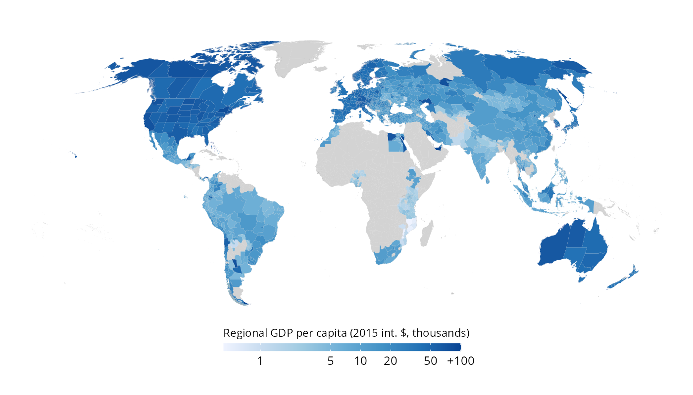

<!-- badges: start -->
[](https://github.com/pablogguz/subincomeR/actions/workflows/R-CMD-check.yaml) [](https://shields.io/)
<!-- badges: end -->

# subincomeR <a href="https://pablogguz.github.io/subincomeR/"></a>

An R package to access [DOSE](https://www.nature.com/articles/s41597-023-02323-8), a global dataset of reported sub-national income data covering more than 1,600 sub-national regions across 83 countries over the period 1960-2020. Data is gathered directly from the relevant governmental statistical agencies, yearbooks, and academic literature, and harmonised accordingly.



# Installation 

```
# install.packages("pak")
pak::pak("pablogguz/subincomeR")
```

-----------------------------------------------------------------

# References 

- Wenz, L., Carr, R.D., Kögel, N. et al. (2023). DOSE – Global data set of reported sub-national economic output. *Scientific Data*, 10, 425. [https://doi.org/10.1038/s41597-023-023](https://doi.org/10.1038/s41597-023-02323-8)

- Wenz, L., Kotz, M., Kalkuhl, M., Carr, R., Kögel, N., Giesen, C., Reckwitz, A., Wedemeyer, J., & Ziegler, K. (2024). DOSE - Global dataset of reported subnational economic output [Data set]. Zenodo. https://doi.org/10.5281/zenodo.13773040
